<h3 align="centre">How my <strong>Embedded Software</strong> works? </h3>

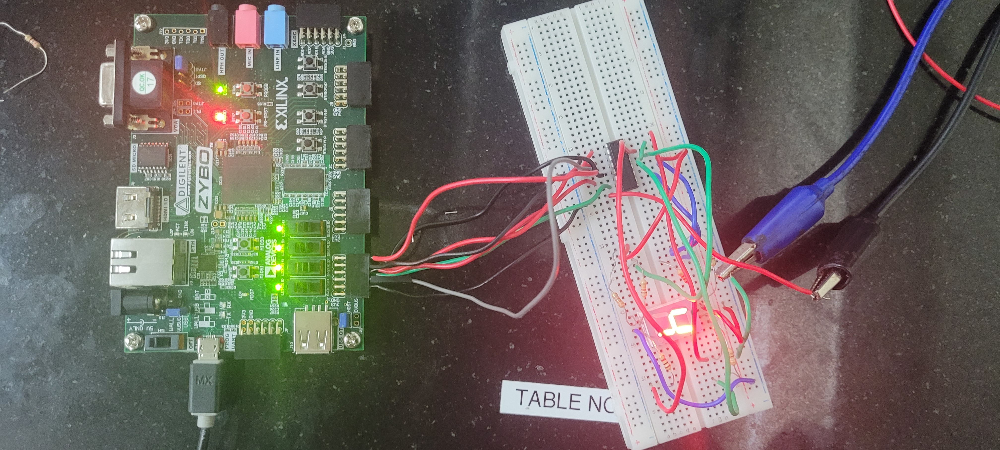
# Designing 24-Hr clock and alarm.

## Problem statement:
Objective:   The aim of this project is to generate a 24 hour clock(depicting hours and minutes) and setting an alarm.  
	      Features of mini project to construct design:  
	      1) Setting clock to desired time whenever needed.  
	      2) Clicking second, minute and hours digits after completion of respective cycles.  
	      3) Setting an alarm, alarm rings whenever time is reached.  
	      4) OFF alarm whenever we want to off alarm.  

## Introduction:
Here, a verilog code is written for 24 hour clock along with alarm, this code is simulated using a test bench in VIVADO software and also implemented on ZYBO 7010 .

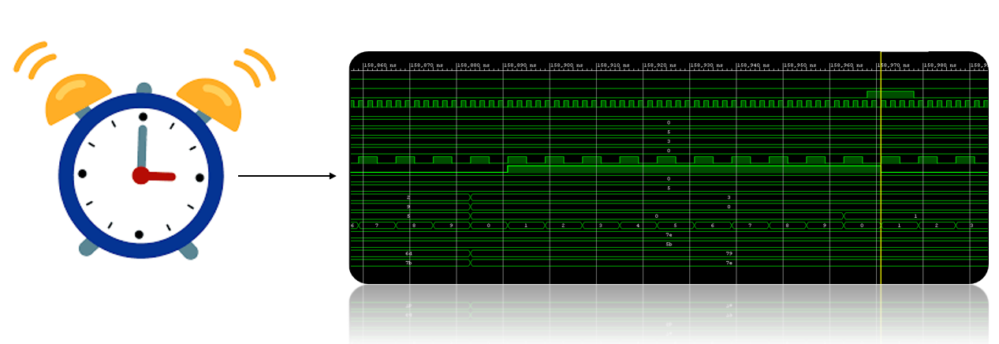

## Clock Generation:

Clock format = H1H0:M1M0  

Clock description:
	1) 24 hour format
	2) Depicts hours and minutes. (seconds can also be implemented using same logic with few changes in code and using more 7 segment displays).
 
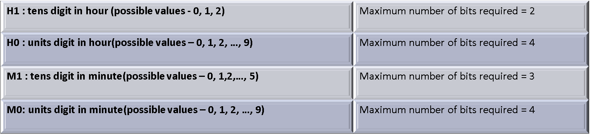

### Desription of approach:
3 up counters are used to generate clock.  

Hour count = 10 * H1 + H0  
Minute count = 10 * M1 + M0  
Second count = 10 * S1 + S0  

1st up counter is for clicking seconds from 00 to 59, 2nd up counter form 00 to 59, 3rd up  counter from 00 to 23.
Whenever one complete cycle is completed in one counter, 1 will be incremented in subsequent counter as depicted in below state diagram.

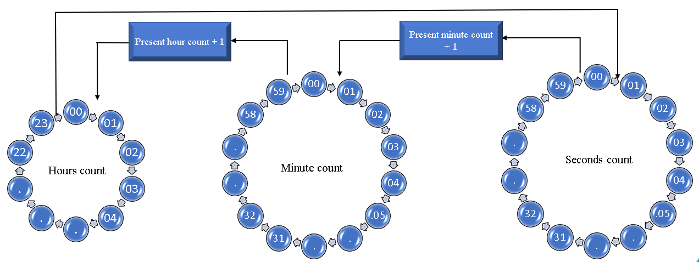
Minute and seconds counter has 60 states, and hours counter has 24 states.

### Flow chart of clock:
Initially hour count and minute count will be based on input given and second count will be zero.

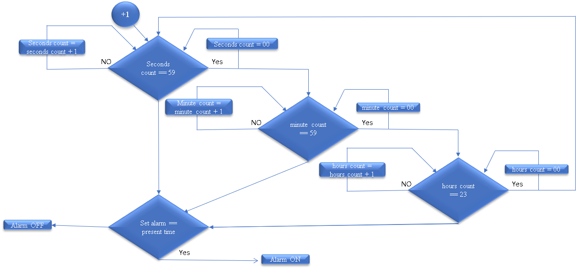

## Alarm:
Alarm which is designed works as follows:  
Whenever we press load_alarm switch, alarm gets loaded with inputs given
1) After reaching into the time given, alarm will ON.
2) Then when we give alarm OFF it will OFF.

Alarm will on whenever the alarm set time is equal to present time, provided alarm off button is off.
Alarm will not on if alarm off button is on even though set alarm time equals present time.
Alarm will have two states they are alarm off and alarm on state with condition checker of present time and alarm set time checker

1) Alarm_on state
2) Alarm_off state

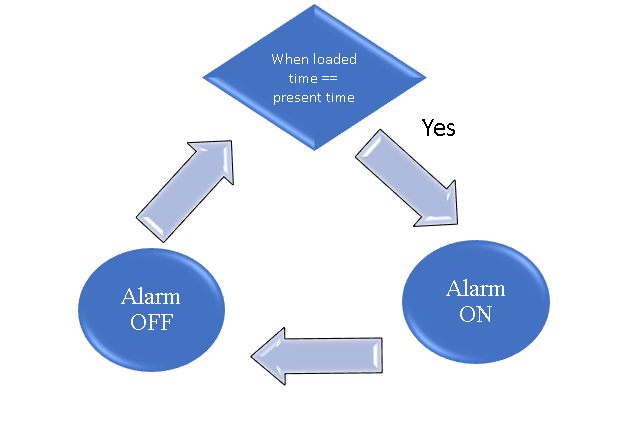

## Test bench:

### Description of test bench:

### Timing diagram:
Initially we load the time so load_time is high, and time 23:59 is loaded:
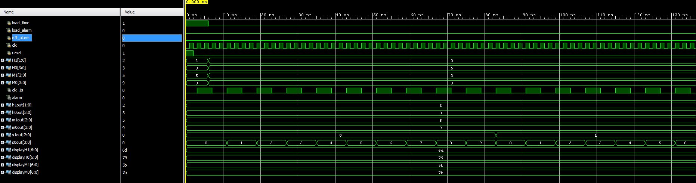

After 1 minute from 23:59, the clock goes to the state 00:00:00. This can be inferred from the following diagram. Whenever we reach 23:59:59 the clock clicks to 00:00:00, hence test case is evaluated:

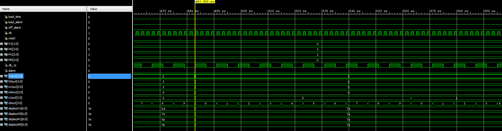

Input is changed to 5:30 and whenever load_alarm is high the alarm will be set:
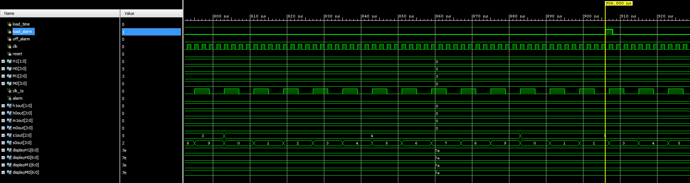

Whenever the loaded alarm time is reached the alarm will on, and it will off whenever we off the alarm:
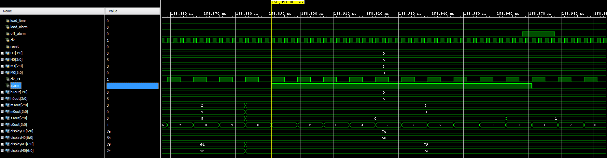

## Zybo implementation:

### Materials required for Zybo-Implementation:
1) [Zybo Board](https://digilent.com/reference/programmable-logic/zybo/start).  
	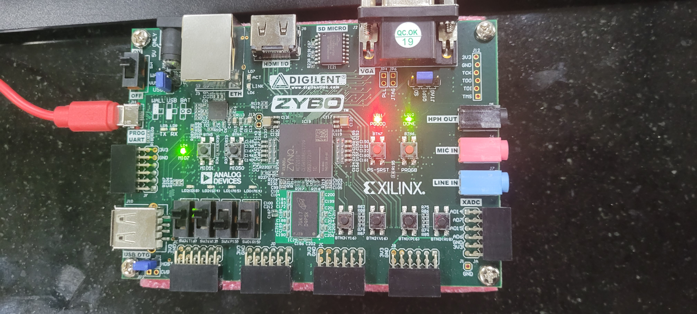

2) 4 seven segment displays(2 for hours, 2 for minutes)  
3) Connecting wires,  
4) 4 ULN 2003.  
	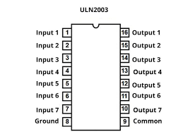
5) Breadboards.  

### Display of H1, H0, M1, M0 using 7 segment display:

Connections in seven segment display:  
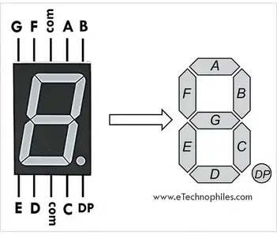

convention followed for representing digits in 7-segment display:

### Zybo board:
Here in the following pictures minute seven segment diaply(M0) is shown:  

Initially M0 = 0:  
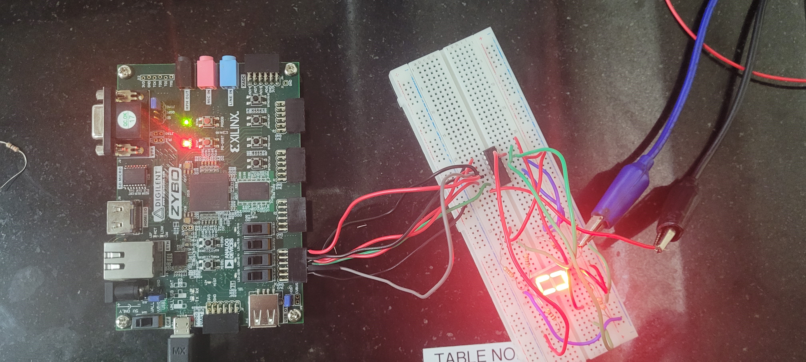

M0 = 1: (after one minute)  
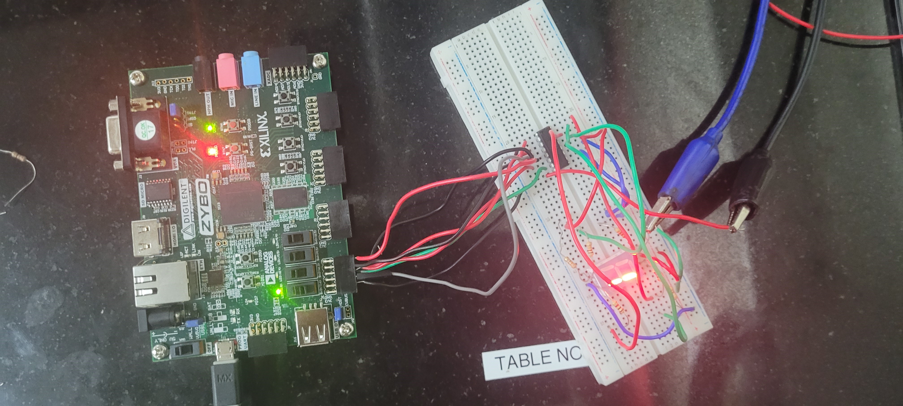

M0 = 2: (after two minutes after starting)  
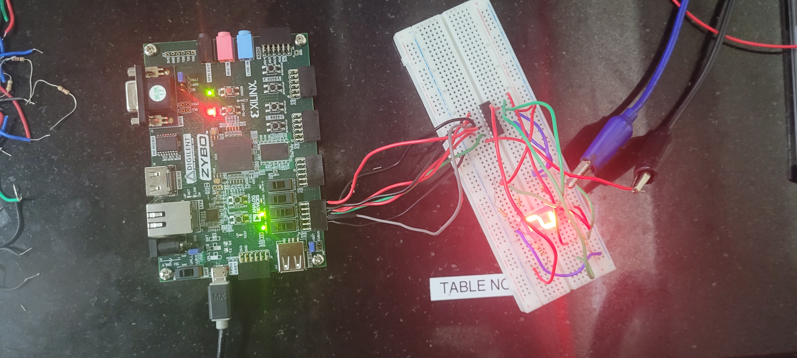

M0 = 3: (after three minutes after starting)  
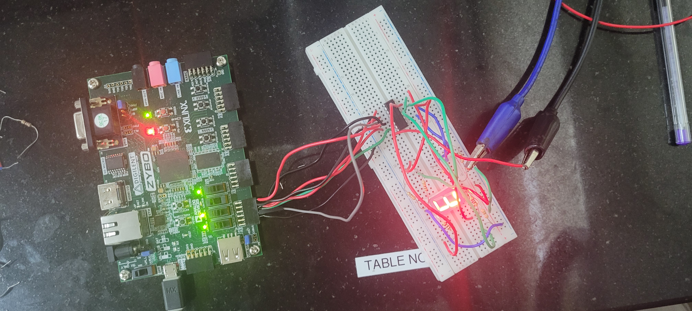

M0 = 4: (after four minutes after starting)   

## Conclusion:
By observing all the test cases which are evaluated in above simulations, the code with zybo implementation has successfully created a chip which can be used to generate 24 hour clock with alarm setting.

## Further scope:
Here we can observe for the above timing diagrams, alarm ON is just one of the signal becoming high. So the coressponding wire can be connected to motor so that iw will perform desired action after certain desired time. 

### Reference:
1) Padmanabhan, T. R._ Bala Tripura Sundari, B. - Design Through Verilog HDL (Padmanabhan_Design Through Verilog HDL) __ (2003, John Wiley & Sons, Inc.) 
2) Digital Design With an Introduction to the Verilog HDL, VHDL, and SystemVerilog(chapter 6).
3) Digital Electronics Principles, Devices and Applications. By Wiley.
4) [Wiki](https://en.wikipedia.org/wiki/Clock_generator)
