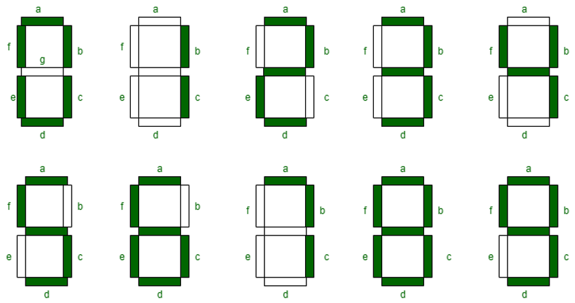

$${\color{blue}Q)How \space my \space Embedded \space Software \space works?}$$
$${Here \space is \space how:}$$


---

# Goal🎯: Design Embedded Software on FPGA for Clock + Alaram

Welcome to this repository!, here you will get to see the following: <br>
✅ **System Design** of Clock + Alaram on real hardware.<br>
✅ **Verilog implementation** on FPGA, for generating required signals. <br>
✅ Testing developed codebase. <br>
✅ Integrate the system with **Integrated Circuits (IC's)** to acheive the goal. <br>
✅ Use **Electronic Display Module (EDM)** for display.

> I love ❤️ to play with hardware, make designs, and most importantly use the hardware to the fullest. This is one of the projects where I used the hardware (FPGA + IC + EDM) for cooking logic, this playground is significantly different from CPU's and GPU's. FPGA's can be used for AI (lot of research papers), control systems and many other places.

<div align="center">
  
  <br/><em>Clock Diagram</em>
</div>

## What's Inside
- ```Hardware```
	- ```FPGA``` ```Zybo Board``` ```Connecting Wires``` ```Integrated Circuit (IC)``` ```Electronic Display Module (EDM)``` ```Seven Segment Display``` ```GPIO (General Purpose I/O) Pins```  ```Breadboard``` ```Power Supply / USB Power```
- ```Embedded Software Development``` / ```System Design```
	- ```Verilog```  ```Test Bench``` ```Vivado (Xilinx)``` ```Finite State Machine (FSM)```


## Problem Statement

The objective of this project is to implement a **24-hour digital clock** (displaying hours and minutes) with an integrated **alarm feature**.

### Key Features:

1. Ability to set the clock to any desired time.
2. Automatic increment of seconds, minutes, and hours upon completion of their respective cycles.
3. Option to set an alarm, which rings when the specified time is reached.
4. Ability to manually turn off the alarm when needed.

## 📷 Design Overview

### Clock Design

* **Clock Format**: `H1H0 : M1M0`
* **Structure**: 3 up-counters track seconds, minutes, and hours.
* **Rollovers**:

  * Seconds: `00 → 59`
  * Minutes: `00 → 59`
  * Hours: `00 → 23`
* **Behavior**: On full cycle of a lower-order counter, the next higher-order counter increments.

<div align="center">
  
  <br/><em>Methods Used</em>
</div>

## 🧠 Approach

* **Counters Used**:

  * `Up Counter 1`: Seconds (00–59)
  * `Up Counter 2`: Minutes (00–59)
  * `Up Counter 3`: Hours (00–23)
* State transitions modeled using a finite state machine (FSM).
* Clock rolls over to `00:00:00` after `23:59:59`.

<div align="center">
  <br/>
  <em>State Transition Diagram</em>
</div>


## ⏰ Alarm Logic

* Alarm time is set using `load_alarm` input.
* Alarm is activated when:

  * `Current Time == Alarm Time`
  * AND `Alarm Off Switch` is LOW
* Alarm deactivates on pressing the `Alarm Off` switch.
* Two FSM states:

  1. `ALARM_ON`
  2. `ALARM_OFF`

<div align="center">
  
  <br/><em>Alarm State Diagram</em>
</div>

---

## 🧪 Testbench and Simulation

The Verilog testbench simulates real-time ticking and alarm functionality.

### ⌛️ Test Cases

* **Load Time = 23:59:00** → Rolls over to `00:00:00`
* **Set Alarm = 05:30** → Alarm triggers when time matches
* Alarm stops only when `alarm_off` signal is high.

#### Test Case Screenshots

| Description               | Timing Diagram                                      |
| ------------------------- | --------------------------------------------------- |
| Loading Time = 23:59      |  |
| After 1 minute → 00:00:00 |  |
| Setting Alarm = 05:30     |  |
| Alarm ON/OFF states       |  |

## 🔌 Hardware Implementation on Zybo

### Materials Used

| Component                                                                        | Description                |
| -------------------------------------------------------------------------------- | -------------------------- |
| [Zybo Z7-10 Board](https://digilent.com/reference/programmable-logic/zybo/start) | FPGA development board     |
| 4 x Seven-Segment Displays                                                       | 2 for Hours, 2 for Minutes |
| ULN2003 IC x4                                                                    | For segment driving        |
| Breadboard, wires                                                                | Circuit assembly           |

#### 7-Segment Display Overview

* Used to display H1, H0, M1, M0
* Displays driven by counters and multiplexing logic

<div align="center">
  <br/>
  <em>7-Segment Display Pinout</em><br/><br/>
  <br/>
  <em>Digit Representation</em>
</div>

#### Hardware Clock Output (Examples)

| Minute Value | Display                         |
| ------------ | ------------------------------- |
| M0 = 0       |  |
| M0 = 1       |  |
| M0 = 2       |  |
| M0 = 3       |  |
| M0 = 4       |  |

## ✅ Conclusion

The 24-hour clock with alarm functionality was **successfully implemented on hardware** using Verilog and the Zybo board. Simulations confirm the correctness of timing and alarm transitions. Hardware results verify proper display and logic functioning.

## 🚀 Future Work

* Integrate buzzer/motor using alarm output signal.
* Extend to display seconds with additional 7-segment displays.
* Add real-time clock synchronization for external inputs.

## 📚 References

1. Padmanabhan, T. R., & Bala Tripura Sundari, B. – *Design Through Verilog HDL*, John Wiley & Sons, 2003.
2. *Digital Design with Introduction to Verilog HDL, VHDL, and SystemVerilog* – Chapter 6
3. *Digital Electronics: Principles, Devices and Applications* – Wiley
4. [Wikipedia – Clock Generator](https://en.wikipedia.org/wiki/Clock_generator)